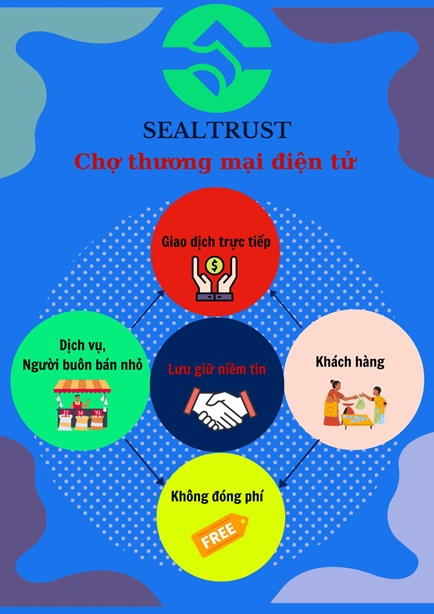

 # Thương Mại Điện Tử Bình Dân

Thương mại điện tử hay nói dễ hiểu là mua bán hàng qua mạng, là hình thức mua bán mới phổ biến sau dịch Covid.
## Vấn đề đặt ra
- Làm sao khai thác nhiều ưu điểm của việc mua bán hàng qua mạng?
  - Người bán, không phụ thuộc vào mặt bằng nhưng vẫn rao tận giường, giao tận nhà, bán tận tay?
  - Người đã mua biết và tin tưởng người bán.  Người mới mua có thể kiểm tra uy tín người bán đã gây dựng lâu nay?
- Làm sao đánh giá đúng uy tín trong chợ mà vẫn bảo đảm được sự cạnh tranh công bằng?
- Làm sao để người cung cấp dịch vụ hoặc bán hàng giá trị cao tìm được khách hàng với chi phí thấp nhứt?
- Làm sao để khách hàng cần dịch vụ hoặc mua hàng giá trị cao nhận được sự cạnh tranh lành mạnh, lấy chữ tín làm đầu, dùng chữ tâm làm trọng?

## Thực trạng
Sinh sau để muộn nhưng chỉ trong vài năm Mua bán qua mạng đã phát triển như nấm sau mưa vì những ưu điểm trước mắt: Người mua hưởng được đúng cảm giác của thượng đế: được rao tận giường, giao tận nhà, bán tận tay…; có thể nằm tại giường mua cây đinh vít ở xứ Tàu cho đến cái Iphone vừa ra ở trời Tây.  Còn người bán thì ai cũng có thể bán, không cần vốn, không cần mặt bằng; chỉ cần dẻo miệng, nhanh tay, múa may, uốn éo một chút là chốt được đơn.

Tuy nhiên với thời gian, các thượng đế cũng đã không ít lần rớt về lại trần gian, ngơ ngác khi tiền đã trao nhưng chỉ múc được nước, không thấy cháo đâu; Buồn bực khi gặp cảnh treo đầu dê bán thịt chó, mua Iphone nhận cục gạch .v.v.

Một số người bán bán hàng qua mạng đã lợi dụng việc không có địa chỉ thông tin cụ thể nên rao một đằng, bán một nẻo, với hình ảnh sáng ngời nhưng thông tin nửa vời.

Một số khác thì tay không bắt giặc, chỉ tìm thông tin mặt hàng rồi rao bán, không cần biết chất lượng ra sao, nguồn gốc thế nào, chỉ biết gom đủ số lượng đặt hàng để hưởng giá sỉ thì đặt hàng và bán chuyển tiếp đi; không đủ số lượng thì bỏ đơn và không lo mất uy tín vì không ai biết mình là ông Năm, bà Bảy ở chốn nào.

Bên cạnh đó, sự ra đời của một số trang thương mại phục vụ việc đặt hàng qua mạng đã tạo công cụ hỗ trợ cho việc rao bán qua mạng trở thành dễ dàng, dễ kiếm thêm thu nhập nhưng người bán không phải chịu trách nhiệm về chất lượng hàng hóa; Riêng các trang này không chịu hoặc chỉ chịu phần nhỏ trách nhiệm về chất lượng các việc mua bán này.

Do đó, niềm tin khi mua bán qua mạng ngày càng giảm sút, hình thành tâm lý chất lượng  mua hàng qua mạng là hên xui. Điều này làm vạ lây cho những người mua ngay bán thật trên mạng và các người bán hàng nhỏ lẻ từ các chợ truyền thống phải thường xuyên gặp cảnh “chợ chiều” từ sáng sớm ngay khi mới bày hàng.

Để bảo vệ uy tín khi tham gia bán hàng qua mạng, một số công ty, nhãn hiệu có danh tiếng, có điều kiện đã lập các trang bán hàng riêng của mình.

Còn người bán nhỏ lẻ thì chỉ còn cách gồng mình chịu trận, cầm cự qua ngày, sống chung với lũ khi đưa thông tin lên bán trong các trang mạng.

Trong mua bán truyền thống, người bán có nơi ở, có chổ bán, có thông tin cụ thể nên người mua có thể: mua chổ quen; so sánh, lựa giá, chọn chất lượng, dặn giữ hàng…; Còn người bán gắng giữ khách, giữ uy tín qua mỗi buổi bán, mỗi món hàng đã bán. Khổ nỗi, uy tín của người bán gắng tạo lập trong nhiều năm thì chỉ có người mua biết, truyền miệng cho nhau và cũng chỉ có thể lưu giữ trong suy nghĩ của những người đã từng mua.

Cùng với sự phát triển ồ ạt của hoạt động bán hàng thì các hoạt động dịch vụ cũng cố gắng ăn theo. Thông qua các mạng xã hội, các mạng truyền thông, người cung cấp dịch vụ thì tích cực rao tìm khách; người có nhu cầu dùng dịch vụ thì cập lực tìm người cung cấp. Nhưng khổ nỗi, các mạng xã hội chỉ gắn những người quen nhau, nên thường xuyên xảy ra cảnh: Lúc cần thì không gặp, lúc gặp thì đã hết cần. Đó là chưa kể, đang thời ăn nên làm ra, rao bán xôm tụ thì bị các trang mạng xã hội khóa chức năng kinh doanh, giảm tương tác vì nhiều lý do. Vậy là công sức gây dựng đổ sông đổ biển.

## Giới thiệp Kèo-app

Nhóm tui đã xây dựng Kèo-app, với mục đích khai thác càng nhiều ưu điểm của việc mua bán qua mạng kết hợp ưu điểm mua bán tại chợ truyền thống cũng như xử lý các vấn đề nêu trên.

Mục đích của Kèo-app là tạo sân chợ bình dân trên điện thoại cho giới buôn bán nhỏ và người làm nghề tự do, là công cụ để họ kết nối cùng khách hàng ở địa phương, tạo uy tín với khách quen, tự quảng cáo đến khách lạ.

Vậy Kèo-app khác với sàn thương mại điện tử lớn như thế nào? Nôm na cho dễ hiểu, app của nhóm tui giống như cái chợ nhỏ của xóm tự phát trong hẻm so với siêu thị sang trọng to lớn ngoài đường. Bằng cái điện thoại đã cài Kèo-app, người bán người mua có thể biết nhau; người bán rao hàng, rao dịch vụ; người mua xem và đặt hàng trực tiếp, nếu không hài lòng có thể mắng vốn trực tiếp hoặc đưa phản hồi lên App.

Kèo-app không cạnh tranh với các app thương mại điện tử về nhiều mặt, mà giá trị mà Kèo-app mang đến giới buôn bán nhỏ, bình dân chính là Lòng tin của khách hàng địa phương, chữ Tín trong buôn bán và chữ Tâm cho khách quen. Đây cũng chính là lý do mà chợ truyền thống vẫn còn hoạt động trước mọi áp lực về giá, về mẫu mã, thương hiệu và hàng hóa đa dạng của các chuỗi siêu thị lớn.

Tiêu chí hàng đầu của Kèo-app là thay các trang xã hội, lưu giữ những ghi nhận của khách hàng qua quá trình mua bán và cung cấp dịch vụ trên mạng Internet. Từ đó khách vãng lai có thể tham khảo để tìm được địa chỉ mới đáng tin cậy.

Nhóm tui tin rằng thước đo lường chính xác về sự thành công của một tiểu thương và dịch vụ là lòng tin, yêu thương của khách hàng dành cho họ. Có được lòng tin thì như yên tâm kiếm cơm qua ngày.

Ban đầu kèo-app có chức năng như trang vàng điện thoại (yellow page) lưu giữ thông tin của tiểu thương và dịch vụ, làm nhịp cầu kết nối giữa họ với khách quen. Lâu dài, uy tín của tiểu thương, dịch vụ và quyền riêng tư của khách hàng sẽ được bảo đảm bằng kỹ thuật của blockchain.

Khi tiểu thương mở shop, lao động tự do mở dịch vụ với kèo-app là họ đã tạo sự hiện diện trên mạng, cập nhật tin tức với khách quen mà không sợ làm phiền lòng họ. Khách hàng dùng kèo-app ngoài là nơi tìm shop, dịch vụ ngay tại địa phương, còn là nơi thu thập kiến thức bổ ích trong cộng đồng.

Kèo-app không thu phí thường trực từ shop và dịch vụ.  Tương lai, thì mô hình thương mại của nhóm tui là kết nối nhu cầu và nguồn cung bằng chi phí hiệu quả nhứt hơn hẳn mô hình quảng cáo, vừa để khách hàng nhận được sự cạnh tranh lành mạnh của chủ shop và dịch vụ, những người lấy chữ Tín làm đầu, dùng chữ Tâm làm trọng.

## Bạn giúp được gì?

Nếu bạn đọc đến đây, Nhóm tui cảm ơn sự quan tâm của quý bạn. Nhóm tui phát triển dự án không theo mô hình của công ty, mà muốn thử nhu cầu và sự ủng hộ của cộng đồng trước khi gây vốn lập công ty. Thước đo sự thành công của Kèo-app là tạo được lòng tin trong cộng đồng, có lòng tin là có tất cả. Vậy bạn có thể chung tay đóng góp được gì?

Trước mắt, nhóm tui cần chừng 30 địa chỉ email của bạn bè thân hữu giúp cài App trong vòng 1 tháng; Các bạn bè thân hữu có thể dùng thử và góp ý phản hồi. Sau khi chạy thử nghiệm, Kèo-app mới có thể ra mắt công chúng, triển khai ở một địa phương nào đó.

Nhóm tui mở mã nguồn (opensource) cho những ai có đam mê IT nếu có ý tưởng hay và có như cầu thì được toàn quyền sử dụng, không bị ràng buộc, không phải bắt đầu thực hiện ý tưởng bằng con số 0. Đóng góp của bạn cho mã nguồn sẽ giúp nhóm tui và cả cộng đồng.

Cảm ơn sự quan tâm của các bạn.

Hãy dùng phone scan mã QR download app cho Android hoặc iPhone

### Android QR

### iPhone QR

