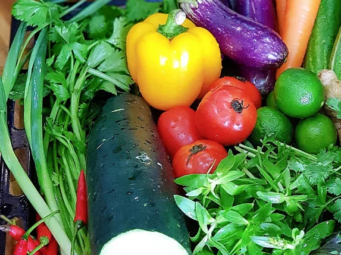

# CÁCH BẢO QUẢN RAU CỦ TRONG TỦ LẠNH

Cất giữ rau củ tủ lạnh là phương pháp nhiều gia đình áp dụng nhưng khó giữ tươi, bỏ ngay 8 mẹo bảo quản rau củ trong tủ lạnh không bị nát, cả tuần vẫn tươi như mới.

**Sử dụng túi nilon để bọc rau củ:** Dùng túi nilon chất lượng có chất liệu là PP để bọc lại rau củ, cách này giúp duy trì độ ẩm của rau củ và hạn chế sự mất nước của chúng, từ đó giúp rau củ luôn nhìn tươi mới, giữ chúng được lâu hơn.

**Sử dụng giấy để bảo quản lâu hơn:** Bạn có thể dùng khăn giấy khô để bọc lại rau củ rồi để trong tủ lạnh, cách này có thể giữ rau củ tươi ít nhất trong 1 tuần, nhất là những loại rau củ có lá. Rửa sạch rau và cho vàotúi bóng, rồi dùng khăn giấy để bọc kín lại rồi mới cho vào tủ, cách này phù hợp để bảo quản rau cần tây, diếp cá, rau cải,... giúp rau giữ được độ tươi, ngon ít nhất một tuần.

**Sử dụng hộp đựng rau củ chuyên dụng:** Sử dụng các loại hộp đựng rau quả chuyên dụng giúp giữ được lượng dinh dưỡng và độ tươi của rau củ hiệu quả, đã vậy dễ sử dụng, thuận lợi và có thể dùng được nhiều lần sau vệ sinh sạch sẽ, tiết kiệm được chi phí.

**Điều chỉnh nhiệt độ phù hợp:** Ngoài những cách nêu trên, bạn có thể điều chỉnh nhiệt độ phù hợp để bảo quản rau củ. Nhiệt độ bảo quản rau củ thích hợp nhất khoảng 3 - 9 độ C. Đồng thời, hiện nay các dòng tủ lạnh đều có thêm ngăn chứa rau củ riêng với nhiệt độ được cài đặt sẵn, đặt rau củ vào ngăn chứa chuyên dụng sẽ đảm bảo được độ tươi lâu hơn.

**Loại bỏ phần hỏng của rau củ:** Trước khi đưa rau củ vào tủ lạnh, thường chúng ta sẽ để rau củ ráo nước rồi mới cho vào ngăn mát tủ lạnh, ngoài rửa sạch ra thì bạn còn phải loại bỏ các phần hỏng của rau để tránh chúng sinh ra khí ethylene, làm rau củ mau chín tự nhiên, dễ bị hư sớm, lây sang các thực phẩm khác.

**Phân loại rau củ trước khi cho vào tủ lạnh:** Mỗi rau củ sẽ có khoảng thời gian bảo quản khác nhau, do đó nếu cho tất cả chúng vào hộp đựng, túi kín,... thì sẽ làm hỏng nhanh hơn, mất chất dinh dưỡng. Nhất là những loại rau củ chín nhanh sẽ sinh ra chất ethylene, làm quá trình phân hủy nhanh chóng, làm mất độ tươi và dinh dưỡng. Vì vậy, trước khi cho vào tủ lạnh thì bạn nên phân loại chúng rồi cho vào màng bọc thực phẩm trước khi bảo quản trong tủ lạnh.

**Tránh cắt nhỏ hay rửa rau không ráo trước khi cho vào tủ lạnh:** Việc cắt nhỏ hay rửa rau rồi cho trực tiếp vào tủ lạnh sẽ dễ làm rau bị hư, biến chất do dư độ ẩm, khiến chúng không giữ được độ tươi, mất chất dinh dưỡng, thậm chí là biến chất. Để bảo quản rau củ hiệu quả, bạn có thể rửa rau sạch rồi để ráo nước rồi mới cho vào tủ lạnh, chỉ có thể cắt bỏ phần ngọn đối với các loại rau củ như cà rốt, su hào, củ cải,... sau đó cho vào tủ.

**Bảo quản rau trong ngăn đá tủ lạnh:** Ngoài việc bảo quản rau củ trong ngăn mát thì chúng ta còn có thể bảo quản chúng trong ngăn đá nữa đấy, đặc biệt với các loại rau củ như ngô, đậu Hà Lan, cà rốt, đậu xanh, cải bẹ, cải thìa,... qua các bước sau đây:

*Bước 1:* Rửa sạch rau củ, cắt bỏ phần thân, rễ, chỗ bị hư hỏng rồi mang đi luộc sơ trong 2- 3 phút, vớt ra ngâm trong nước đá cho nguội.

*Bước 2:* Sau đó, vớt chúng ra và thấm khô chúng bằng khăn giấy sạch, rồi cho vào các đồ dùng bảo quản như hộp đựng thực phẩm chuyên dụng, túi đông lạnh có khóa zip và đặt chúng vào ngăn đá tủ lạnh.
