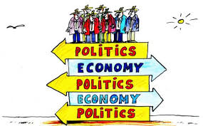

# Kinh Tế, Chính Trị, và Toàn Cầu Hóa - Phần 5
# Câu Chuyện Quản Trị, Hồng Hay Chuyên
Toàn cầu hóa làm thế giới thêm phẳng, Nhật Bản và Tây Đức cần 10 năm để vực dậy từ đống tro tàn của Thế chiến II; Nam Hàn, Ba Lan cần 30 năm để có nền kinh tế năng động; tương tự, Trung Quốc cần cùng khoản thời gian và thêm 10 năm nữa để trở thành cường quốc kinh tế thứ 2 sau Hoa Kỳ. Ngày nay nếu xét về sản lượng công nghiệp như sắt, thép, Trung Quốc bứt xa mọi quốc gia toàn cầu; kể cả thành phẩm công nghệ phức tạp như xe ôtô, hãng xe Trung Quốc BYD bán số lượng xe vượt xa hãng Tesla của Hoa Kỳ.

Thành tích kỳ diệu này không phải quốc gia nào cũng làm được, đòi hỏi nhiều yếu tố, trong đó mô hình quản trị vĩ mô của một đảng độc tài theo định hướng XHCN được đánh giá là vai trò quan trọng nhứt. Trong chánh quyền cũng như doanh nghiệp, triết lý quản trị và chiến lược quản lý là yếu tố quyết định khả năng tồn tại lâu dài của một thể chế công cộng và định chế tư nhân. Câu hỏi ở tiêu đề đi ngược dòng thời gian, trở lại thời kỳ đầu vàng son của khối XHCN, đó là đào tạo con người Hồng hay Chuyên?

Sau Thế chiến II, Liên Xô không cần thế giới phẳng của toàn cầu hóa, nhưng vẫn trở thành cường quốc quân sự, là đầu tàu kinh tế của khối XHCN. Dù bị chiến tranh tàn phá, thiệt hại nặng về người và của, sau chiến tranh, Liên Xô có được số vốn liếng lớn về kỹ thuật của Hoa Kỳ và Đức, nhứt là thừa hưởng trọn máy móc, kỹ nghệ từ phần của Đông Đức. Thời gian đầu, Liên Xô có nhiều người tài đóng góp cho kỹ nghệ hàng không, quốc phòng, không gian; có lúc kỹ nghệ điện tử của Liên Xô cho ra thành phẩm hơn hẳn so với Hoa Kỳ. Câu chuyện sau đó thì ai cũng biết, do trọng Hồng hơn Chuyên, nền kinh tế Liên Xô bị lạc hậu và hoạt động thiếu hiệu quả.

Hồng hay Chuyên không chỉ là vấn đề quản trị của khối XHCN, nền kinh tế tự do của Hoa Kỳ luôn phải đối mặt với vấn đề đó trong triết lý quản trị ở mọi cấp.

Chuyên là chuyên môn, chuyên nghiệp là kiến thức nhà nghề của doanh nghiệp. Phạm trù vĩ mô của chánh quyền, chuyên ở đây là có kiến thức gần với giới chuyên gia, chuyên nghiệp. Mọi kế hoạch, mọi dự án, mọi quyết định đầu tư đều dựa theo thông số nhà nghề, thực tế kỹ thuật, khác với vận dụng duy ý chí, quyết tâm chính trị của Hồng.

Trong nền kinh tế tự do, Hồng là duy ý chí, là quyết tâm đạt được mục tiêu theo một tiêu chí nào đó. Dễ thấy nhứt là kinh doanh bằng tiếp thị, đoán bắt nhu cầu của thị trường. Rất phổ biến là quản trị bằng con số của bản kế toán tài chính, nhìn số liệu mà quyết định chi phí và mức lời lỗ bất kể thực tế từ chuyên môn. Triết lý quản trị theo Hồng hay Chuyên quyết định khả năng thành đạt lâu dài, cũng như thất bại nhất thời; phạm sai lầm dễ dẫn đến phá sản của doanh nghiệp. Phạm trù vĩ mô của chánh quyền, Hồng trong xã hội tự do cũng giống với lòng tin, lòng trung thành trong khối XHCN, là lòng tin vào ý thức hệ khuynh tả hay hữu, theo bảo thủ hay cách tân.

Kinh tế tự do vận hành theo “bàn tay vô hình" của Adam Smith, hay theo phiên bản hiện đại, tinh thần tìm “đại dương xanh làm cá đỏ” thay vì đấu tranh sinh tồn của “cá xanh trong đại dương đỏ". Muốn lấy tiền từ túi người khác, những người đi tìm đại dương xanh buộc phải có Chuyên nhiều hơn Hồng mới mang được nhiều giá trị nổi bậc, khó bị sao chép ra thị trường. Đại dương xanh là chốn đào thải, làm lỗi thời nhiều đại dương đỏ đang bão hòa, nơi có nhiều cá xanh phải vật lộn để sinh tồn. Nó mang lại cuộc cách mạng công nghiệp 1.0, 2.0… đến nay là 4.0 với đủ nhu cầu và tiện nghi không ai tưởng tượng nổi, là nền tảng kỹ thuật mang lại kết quả kỳ diệu của thế giới phẳng từ toàn cầu hóa. Nhờ có nó mà thế giới không cần phải giành giựt, chém giết nhau trong trò chơi của luật bù trừ (zero-sum game). Ngược lại, nó mang lại positive sum game, trò chơi cộng hưởng, mang cơ hội tới mọi hẻm hóc của quả địa cầu. Ngày nay, một người nghèo nhứt vẫn sở hữu dễ dàng một máy tính cầm tay, mạnh hơn siêu máy tính đắt tiền cách đây 1/2 thế kỷ.

Như vậy, phải chăng Chuyên hơn Hồng là cách quản trị hiệu quả nhứt? Mô hình chính trị của Trung Quốc là kỹ trị theo Chuyên, định hướng là XHCN theo Hồng; đó có phải là mô hình ưu việt so với sự già cỗi cả trăm năm của CNTB, của sự suy thoái của nền kinh tế chỉ biết lợi nhuận của Hoa Kỳ. Nền kinh tế hiện đại của Hoa Kỳ không thể xây nổi một hệ thống tàu cao tốc, tự túc được chuỗi cung ứng làm cuộn giấy vệ sinh, khẩu trang y khoa, chiếu theo quan điểm của nhiều người hiện nay?

Phần lớn CEO của các tập đoàn lớn Hoa Kỳ theo ngành kinh tế, tài chính, có bằng quản trị kinh doanh MBA. Đa số nghị sĩ Quốc hội Hoa Kỳ có chuyên môn từ luật, tài chính, kinh tế, rất hiếm có người theo học kỹ thuật. Trong khi đó, đa số CEO và cấp lãnh đạo của Trung Quốc đều được đào tạo từ kỹ thuật mà ra. Đó có phải là Chuyên hơn Hồng trong cách quản trị của Trung Quốc, từ chánh quyền đến doanh nghiệp?

Triết lý ngàn năm của Trung Quốc là tìm lấy điểm cân bằng, hài hòa, tôn ti, trật tự xã hội, và theo đó là thời thanh bình, thịnh trị, lấy Đức thay Pháp trị dân, y lệ cũ mà làm không thay đổi gì mới. Theo triết lý đó suốt 5000 năm lịch sử, Trung Quốc chỉ có vài triều đại cực thịnh là Hán, Đường với thời gian thanh bình thua một đời người. Các triều đại thời cận đại của Trung Quốc đều do các bộ tộc ở ngoài chinh phục, chiếm đoạt Trung-Nguyên, từ nhà Nguyên, đến Minh, đến Thanh. Vấn đề là từ Chuyên đổi qua Hồng thì giữ vững thành quả dễ hơn nhiều so với tiếp tục đào sâu chuyên môn nhà nghề. Đã chiếm được đại dương đỏ thì tha hồ ăn cá xanh, khai thác lợi nhuận từ đó dễ hơn nhiều là chật vật, mày mò với rủi ro đi tìm đại dương xanh mới.

Thời nhà Minh, truyền thuyết rằng Trung Quốc có hạm đội rất lớn đi khắp thế giới, khám phá Châu Mỹ trước Columbus của Phương Tây. Vấn đề quan trọng là khám phá xong để làm gì khi Trung Quốc tìm ra được thuốc súng, dệt lụa, nhưng lại dừng ở đó không phát triển nổi kỹ nghệ làm ra súng đạn, phi pháo, hoặc máy dệt đại trà, dệt vừa cho ra nhiều vải, vừa có giá thành thấp như Phương Tây. Columbus khám phá Châu Mỹ mở ra kỷ nguyên của thuyền buồm, sinh ra Đế Quốc Tây Ban Nha, sau đó là Đế Quốc Anh lớn nhứt lịch sử thế giới.

Cốt lõi của vấn đề là đối với Trung Quốc, Hồng về chính trị mới nắm trọn quyền lực, quyết định dồn tài nguyên, nội lực nào cho phần Chuyên. Chính trị Trung Quốc không chấp nhận có sự đổi ngôi từ quyền lực kinh tế, từ Chuyên mang lại. Nói cách khác, quản trị theo Chuyên của Trung Quốc là để phục vụ chính trị, theo định hướng của Hồng, không thể soán ngôi.

Thực ra đây không phải là vấn đề nổi bậc, tiêu biểu của Trung Quốc. Phần lớn các tập đoàn, doanh nghiệp lớn của Hoa Kỳ cũng đều theo lộ trình tương tự, sau khi Chuyên đã chiếm lĩnh được đại dương xanh, thành cá đỏ làm bá chủ ở đó, triết lý quản trị dần chuyển sang Hồng bảo vệ thị phần của họ. Khi sức mạnh của một tập đoàn từ chất xám của kỹ thuật, lấy từ sự diệu kỳ của khoa học, chuyển sang trí khôn của tài chính, tìm thấy sự kỳ ảo của sổ kế toán, sự khôn lỏi của tiếp thị, đó là lúc mà doanh nghiệp chuyển thế, bảo vệ đại dương đỏ và vị trí bá chủ của nó.

Ví dụ dễ thấy nhứt là trường hợp hãng làm máy bay Boeing, đại diện cho công nghệ hàng không của Hoa Kỳ. Từ một hãng thuần kỹ thuật, lấy mọi tiêu chí kỹ thuật làm trọng, mở kỷ nguyên du lịch bằng máy bay phản lực, đến lúc khó tìm ra được đại dương xanh mới, bộ máy quản trị của Boeing đổi hướng. Họ trọng mọi tiêu chí theo các con số của báo cáo tài chính, của thống kê kế toán. Ban đầu lợi nhuận kiếm được nhờ thắt chặt chi phí sản xuất, cắt giảm phung phí trong mọi khâu sản xuất. Họ quản lý chặt đến độ lượng ốc vít không bị thất thoát đã tiết kiệm được cho công ty trên 2 triệu USD/năm. Như con nghiện thuốc, hội đồng quản trị càng muốn bỏ ít vốn, kiếm càng nhiều lời từ các con số trong bảng kế toán, áp lực lên mọi cấp quản lý càng nặng, buộc họ càng cắt nhiều công đoạn - kể cả cắt bỏ nhiều quy trình giám sát an toàn. Chiếc Boeing 737 Max thay vì là một kỳ công kỹ thuật, tiết kiệm xăng, và chi phí vận hành, lại trở thành ác mộng tài chính cho chính hãng. Boeing cắt nhiều công đoạn quan trọng khi giới thiệu kỹ thuật mới làm rớt mất hai chiếc, giết chết toàn bộ hành khách và phi hành đoàn. Sau khi bỏ lỗ (write off) gần $20 tỷ USD để sửa lỗi an toàn này, chiếc 737 Max được phép bay và bị cấm trở lại chỉ sau 4 tháng, lý do là cửa thoát hiểm bị bung ra trong lúc bay.

Không khó tìm ví dụ chuyển đổi triết lý quản trị như hãng Boeing, khó là tìm được công ty, tập đoàn nào có sức sống kéo dài trên ba thế hệ quản lý, có tuổi thọ trên 100 năm. Khác với triết lý tìm lấy điểm tĩnh, cân bằng, hài hòa của Trung Quốc, thị trường tự do là sự tàn phá có sáng tạo (creative destruction), của tre già măng mọc, để cây đại thụ mục rỗng tự sụp đổ, thay vào đó là bao mầm trẻ có đất và dưỡng chất vươn lên tầm cao mới. Từ hỗn loạn tìm đến trật tự mới, lại tiếp chu kỳ hỗn loạn, không có gì đứng vững, trường tồn, không thay đổi với thời gian.

Thực ra Chuyên hơn Hồng không phải là cách quản trị có sức bứt phá khỏi mức giới hạn của kiến thức. Người nổi tiếng trong cách quản trị Hồng là Steve Jobs, ông ta buộc giới chuyên gia làm nhiều chuyện mà kiến thức nhà nghề gọi là không-tưởng, điên rồ. Nhiều khi ông đi trước thời đại, bị thất bại, bị đuổi ra khỏi hãng Apple do ông thành lập. Nhân viên kỹ thuật làm với ông thường nói về “reality distortion field" (thực trường bóp méo?), phải bóp méo thực tế hiện tại mới làm được những gì ông muốn. Câu chuyện sau đó thì ai cũng biết, nhờ có sự điên rồ, có khi không-tưởng này mà giới kỹ thuật mới có nhiều khám phá mới. Những người như Steve Jobs không hiếm trong nền kinh tế tự do của Hoa Kỳ, sự khác biệt là phần lớn họ đều trả giá đắt do muốn bóp méo thực tế quá mức, quá sức, mà không có đủ tài lực, nhân lực thực hiện điều họ mong muốn.

Quay trở lại với bằng cấp của CEO, một điều ít người biết là đa số CEO giỏi đều theo học Toán hoặc Vật lý trong những năm đầu Đại học. Nghị sĩ Hoa Kỳ thuộc Lập pháp đa số có bằng luật, nhưng phần lớn T.Thống Hoa Kỳ thuộc Hành pháp lại Hồng nhiều hơn chuyên, cung cách quản trị giống Steve Jobs. Họ buộc giới chuyên gia, dân nhà nghề phải bóp méo thực tế theo viễn kiến của họ, theo nghị trình họ đã hứa hẹn với cử tri.

Dù hiện tại Trung Quốc có thành công đến đâu vẫn nhứt thời như bài học của Liên Xô, dù có trọng Chuyên đến mấy. Với con số thống kê ấn tượng về tỷ lệ tăng trưởng, sản lượng sắt thép, xe điện, năng lượng xanh… tuy đầy ấn tượng, nhưng phần đóng góp của Trung Quốc cho Toán hiện đại là gần bằng 0; dù rằng Trung Quốc luôn giữ ngôi quán quân trong mọi kỳ thi Toán quốc tế. Tương tự ở các lĩnh vực khác như vật lý, sinh học, y khoa... Đóng góp lớn nhứt của Toán học hiện đại là lập ra mô hình AI, bảo mật của cloud, của blockchain; trong đó Trung Quốc vượt trội thu thập, cung cấp dữ liệu cho các mô hình AI, và hack bẻ khóa thâm nhập lỗ hổng trong an ninh mạng. Tương lai của Toán hiện đại là tạo mô hình giải mã nhiều điều bí ẩn từ thế giới của Quantum.

Kiến thức Toán và Vật lý giúp nhiều CEO giỏi của Hoa Kỳ tôn trọng giới hạn của thực tế và biết sử dụng tài năng Chuyên. Thị trường tự do không chọn đâu là định hướng Hồng để dồn mọi tài nguyên, nhân lực của Chuyên vào. Thay vào đó là Pháp, là phân giải mâu thuẫn, xung đột từ hệ thống luật Pháp không dựa vào văn bản, câu từ, mà theo sát mọi nguyên tắc của khoa học. Sức mạnh của một hệ thống luật pháp không phải từ Hồng tuân theo định hướng chính trị, hay Chuyên lấy từng dòng, từng chữ của văn bản, của bộ luật mang ra áp chế; mà là Chuyên hiểu nguyên tắc của luật, của khoa học nhân văn với đủ mức độ phức tạp của nó, để giải quyết xung đột giữa người với người trong hòa bình, tìm đến một sự thật duy nhứt của công lý bằng các phương pháp khoa học, của Toán học.

Xã hội và nền kinh tế vận hành không chỉ đơn thuần làm ra hơn chỉ tiêu của những con số, làm gấp chục lần sản lượng thép mà không có nơi tiêu thụ; hoặc xe điện đốt giai đoạn kỹ thuật có thể phát cháy bất kỳ sau 10 năm. Câu chuyện quản trị quá cứng ngắc với Hồng hay Chuyên là lối mòn dẫn đến sự nhảy múa của các con số, sự ma quái của bản thống kê. Nền kinh tế tự do cần đến sự phân giải mang công lý đến cho những người dám cất công đi tìm đại dương xanh, dù rằng sau đó họ trở thành cá đỏ thao túng vùng đại dương ấy. Nền tảng của công lý không thể dựa vào câu văn vô hồn, thông thường là lỗi thời của điều luật, của bộ luật viết trong quá khứ; càng không thể dựa vào Đạo đức của người cầm cân nẩy mực. Kiến thức chuyên môn, nhà nghề về luật pháp là lý do tại sao nhiều hợp đồng thương mại quốc tế được viết bằng tiếng Anh, đặt dưới quyền chế tài hệ thống tòa án của Anh và Hoa Kỳ. Đó là lý do tại sao đa số nghị sĩ Quốc hội Hoa Kỳ đều có bằng cấp cao về Luật.

Tin đầu năm 2024 là khối BRICS sẽ gia tăng thành viên, loại bỏ đồng USD. Có khá nhiều bài viết bản cáo phó cho đồng USD. Thương mại quốc tế không chỉ đơn thuần là trả tiền lẫn nhau, mà là thực thi hợp đồng, chia sẻ quyền lợi lúc thuận lợi, và phân trải rủi ro khi khó khăn. Sức mạnh của một đồng tiền là lúc canh không lành, cơm không ngọt. Chừng nào hệ thống BRICS có Hải quân đủ sức tuần tiễu mọi tuyến đường trên biển và có hệ thống tòa án độc lập, lúc đó vị thế đồng USD mới bị lung lay. Thực ra, khi Trung Quốc có được tòa án độc lập thì lúc đó chính trị không còn quyền quyết định đến kinh tế. Khi đó, Trung Quốc không còn là Trung Quốc của 5000 năm lịch sử nữa.

*1/2024*

*Vy Nguyen*
